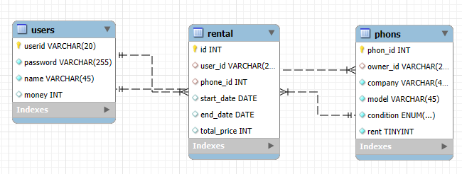
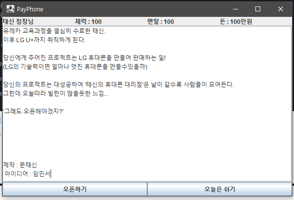

# Payphone 📞
> LG U+ 유레카 미니 프로젝트 1  
> 25.03.05 ~ 25.03.07

## 프로젝트 소개
'휴대폰 판매 시스템'을 들었을때 문득 Maroon 5 - Payphone 이라는 노래가 떠올랐습니다.  
이 노래를 들으며 공중전화처럼 돈을 넣고 전화를 잠시 대여해주는 서비스를 생각했습니다.

주요 기능은 다음과 같습니다.
1. 휴대폰 빌리기 : 기종과 요금제 그리고 기간을 선택하고 휴대폰을 대여합니다.
2. 휴대폰 빌려주기 : 휴대폰을 대여해주고 일정 금액을 받습니다.

## 기술 스택
| Position | stack       |
|----------|-------------|
| FrontEnd | Java Swing  |
| BackEnd  | Java, MySQL |

## 시스템 아키텍처

## 기능

