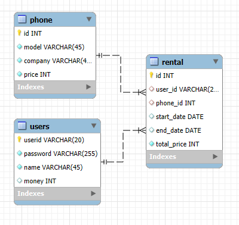

# Payphone1 📞
> LG U+ 유레카 미니 프로젝트 1  
> 25.03.05 ~ 25.03.05

## 프로젝트 소개
휴대폰 목록을 생성, 조회, 수정, 삭제하는 프로그램입니다.

주요 기능은 다음과 같습니다.
1. 조회, 검색 : 휴대폰 목록을 조회하고, 검색합니다.
2. 수정, 삭제 : 휴대폰을 수정하거나 삭제합니다.

## 기술 스택
| 분야       | 기술               |
|----------|-------------------|
| FrontEnd | Java Swing        |
| BackEnd  | Java, MySQL, JDBC |

## 시스템 아키텍처

## 이미지

---

# Payphone2 📞
> LG U+ 유레카 미니 프로젝트 1  
> 25.03.06 ~ 25.03.06

## 프로젝트 소개
Payphone1에서 Java Swing GUI를 더 활용하여 만든 게임입니다.

주요 기능은 다음과 같습니다.
1. 캐릭터 생성 : 이름을 설정하여 캐릭터를 생성할 수 있습니다.
2. 선택 : 게임의 선택지가 랜덤으로 주어집니다. 상황에 따라 선택해야합니다.

## 기술 스택
| 분야       | 기술               |
|----------|-------------------|
| FrontEnd | Java Swing        |
| BackEnd  | Java, MySQL, JDBC |

## 시스템 아키텍처

## 이미지
  
  
  
  
  

---

# Payphone3 📞
> LG U+ 유레카 미니 프로젝트 1  
> 25.03.07 ~ 25.03.07

## 프로젝트 소개
Payphone2에서 Swing을 포기하고 데이터 모델링에 중점을 둔 프로젝트입니다.

주요 기능은 다음과 같습니다.
1. 랜덤한 요구사항 : 손님이 랜덤하게 휴대폰 견적을 요청합니다.
2. 요구사항에 맞춘 제작 : 손님의 요구사항에 맞게 휴대폰을 제작해야합니다.

## 기술 스택
| 분야       | 기술               |
|----------|------------------|
| FrontEnd | Java 터미널         |
| BackEnd  | Java, MySQL, JDBC |

## 시스템 아키텍처

## 이미지
  
  
  
  
